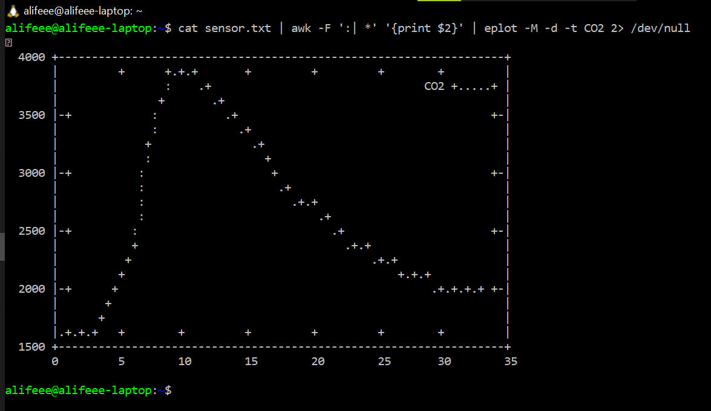

# CO2 Monitoring

Attempts to monitor CO2 with microcontrollers and sensors.

## Sensor used

[Sensirion SCD40](https://developer.sensirion.com/products-support/scd4x-co2-sensor/) -> [Sensirion_SCD4x_Datasheet.pdf](./Sensirion_SCD4x_Datasheet.pdf)

## Microcontroller used

[ESP8266 D1 Mini](https://www.wemos.cc/en/latest/d1/d1_mini.html)

## Requirements

[Platform IO](https://platformio.org/) for VSCode. Follow their guide to get started.

## How to build

1. Select correct board with Platform IO.
1. Build & upload with Platform IO
1. Connec to COM Port with serial monitor
