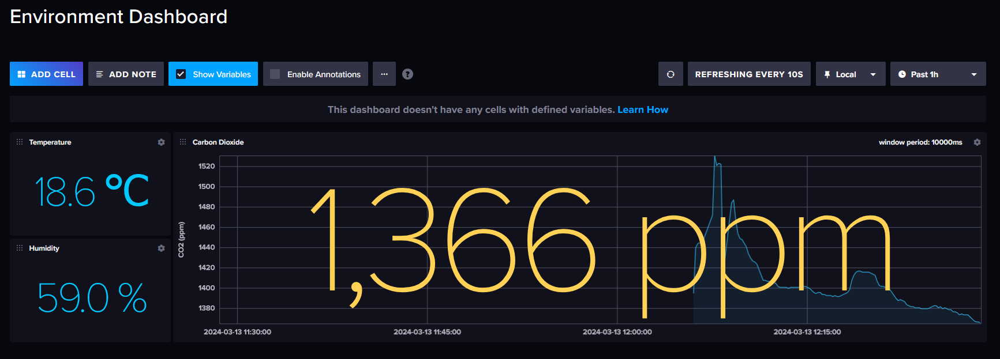

# CO2 Monitoring

Monitoring CO2 levels, and temperature with an ESP8266 D1 Mini microcontroller and a Sensirion SCD40 CO2 sensor.

To be connected to a time-series database like [InfluxDB](https://docs.influxdata.com/influxdb/v2/install/)...

...or used to manually probe data via the serial monitor...

## Sensor used

[Sensirion SCD40](https://developer.sensirion.com/products-support/scd4x-co2-sensor/) -> [Sensirion_SCD4x_Datasheet.pdf](./Sensirion_SCD4x_Datasheet.pdf)

## Microcontroller used

[ESP8266 D1 Mini](https://www.wemos.cc/en/latest/d1/d1_mini.html)

## Requirements

[Platform IO](https://platformio.org/) for VSCode. Follow their guide to get started.

## How to build

This is setup to use InfluxDB. First, set up an InfluxDB instance on a server following the [guide](https://docs.influxdata.com/influxdb/v2/install/).

### Secrets file

Project secrets are stored in `./src/secrets.h`. There is an example secrets file [`./src/secrets.example.h`](./src/secrets.example.h).

This contains:

- InfluxDB secrets (URL, organisationm access token, bucket)
- WiFi secrets (SSID, password)

### Build

1. Select correct board (D1 Mini) with Platform IO.
1. Build & upload with Platform IO
1. Connect to COM Port with serial monitor

## Plot data manually

Live-plot example data: use `PuTTY` to create a log file (`putty.log`), and use bash's `watch` to plot the data, e.g., using gnuplot/eplot - [see guide](https://gist.github.com/alifeee/2e1ea8ad5290a553316e715f658f1fd7).
