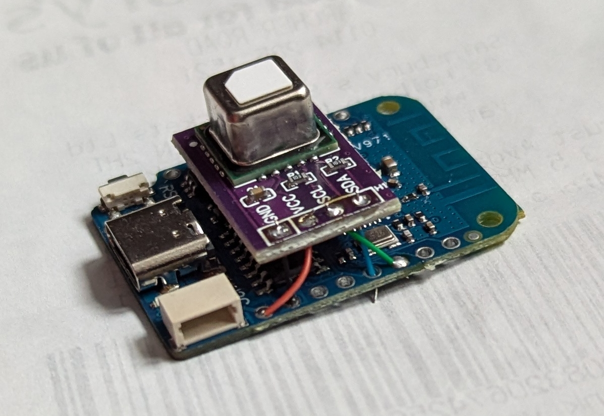
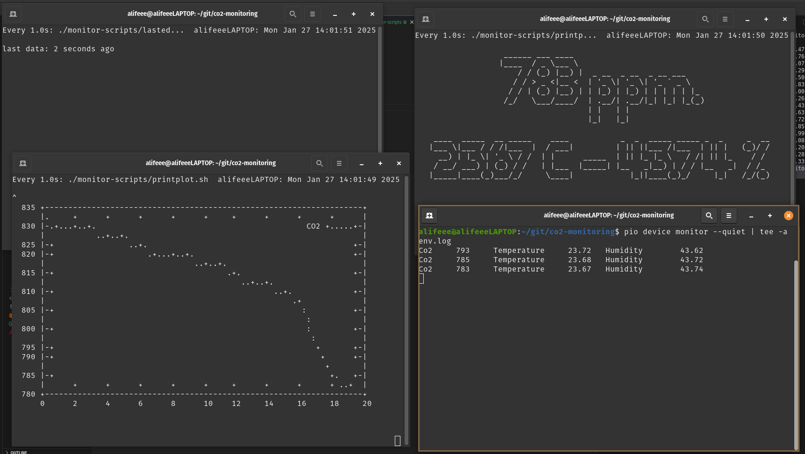

# CO2 Monitoring

Monitoring CO2 levels, and temperature with an ESP8266 D1 Mini microcontroller and a Sensirion SCD40 CO2 sensor.

To be connected to a time-series database like [InfluxDB](https://docs.influxdata.com/influxdb/v2/install/)...


...or used to manually probe data via the serial monitor...


## Sensor used

## Environment monitor

The monitor is an SCD40: <https://sensirion.com/products/catalog/SCD40>

It has an accuracy of:

- CO2 accuracy: ±50.0 ppm
- temperature accuracy: 0.8 °C
- relative humidity accuracy: 6 %RH

[Sensirion SCD40](https://developer.sensirion.com/products-support/scd4x-co2-sensor/) · [Sensirion_SCD4x_Datasheet.pdf](./Sensirion_SCD4x_Datasheet.pdf)

## Microcontroller used

[ESP8266 D1 Mini](https://www.wemos.cc/en/latest/d1/d1_mini.html)

## How to build

### Hardware

Attach the ESP to the SCD40 any which way you desire. Here is one option:

See a pinout reference diagram e.g., [this one](https://randomnerdtutorials.com/esp8266-pinout-reference-gpios/), and connect:

| SDC40 | ESP8266 |
| --- | --- |
| GND (ground) | GND (ground) |
| VCC (supply voltage) | 5V |
| SCL (SPI clock) | GPIO5 / SCL |
| SDA (SPI data) | GPIO4 / SDA |



### Build

First, install <https://platformio.org/> as a command line interface (CLI).

To test PlatformIO, upload the ["blink" program](./src/main-blink.cpp), which should blink the inbuilt ESP LED once every second.

#### Test with `blink.cpp`

```bash
# build firmware/software
pio run -e blink
# upload (flash device)
pio run -t upload  -e blink
```

#### Test with `monitor.cpp`

Then, upload the monitor program. This should flash the current CO2 levels on the LED, and output them to serial.

```bash
# build firmware/software
pio run -e monitor
# upload (flash device)
pio run -t upload -e monitor
# monitor (serial)
pio device monitor
```

Once it works, you can run some terminals to view live graphs and a display using the scripts in the `monitor-scripts` folder. First, log the data to a file `env.log` using

```bash
pio device monitor --quiet | tee -a env.log
```

Then run each of the scripts like `watch ./monitor-scripts/printppm.sh`, resulting in something like:



#### `logger.cpp`

This is setup to use InfluxDB. First, set up an InfluxDB instance on a server following the [guide](https://docs.influxdata.com/influxdb/v2/install/).

Then, create an API access token, and edit the secrets file:

Project secrets are stored in `./src/secrets.h`. There is an example secrets file [`./src/secrets.example.h`](./src/secrets.example.h).

This contains:

- InfluxDB secrets (URL, organisationm access token, bucket)
- WiFi secrets (SSID, password)

Install the logger firmware with:

```bash
# build firmware/software
pio run -e logger
# upload (flash device)
pio run -t upload -e logger
# monitor (serial)
pio device monitor
```

You should see any success/error messages in the serial output,
